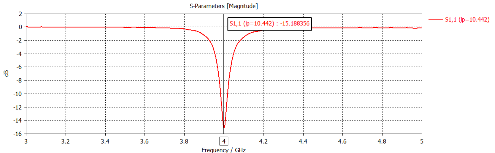
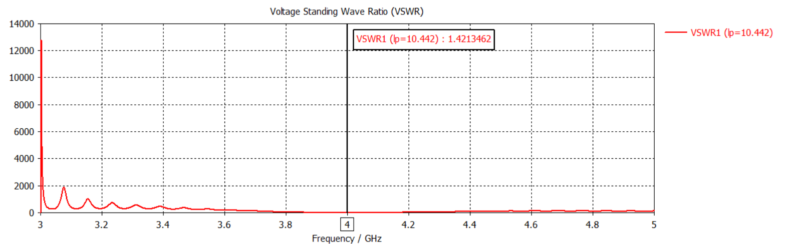
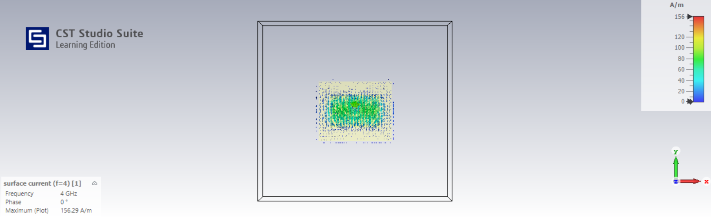

# Microstrip Patch Antenna Design - CST Studio Suite

## 📌 Overview
This project focuses on designing and simulating a **Microstrip Patch Antenna** using **CST Studio Suite**, optimized for a resonant frequency of **4 GHz**. The simulation includes key performance parameters such as **S11 (Return Loss)**, **VSWR (Voltage Standing Wave Ratio)**, and **Current Distribution** to evaluate the antenna's efficiency.

## 🎯 Design Specifications
- **Software:** CST Studio Suite
- **Antenna Type:** Microstrip Patch Antenna
- **Resonant Frequency:** 4 GHz
- **Substrate Material:** (Specify material, e.g., FR4, Rogers RT Duroid)
- **Substrate Thickness:** (Specify thickness)
- **Patch Dimensions:** (Specify dimensions)
- **Feed Type:** (Microstrip Line or Probe Feed)

## 🔬 Simulation Parameters
### 1️⃣ **S11 (Return Loss)**
- **Objective:** Evaluate signal reflection at the input port.
- **Expected Result:** **S11 < -10 dB** for good impedance matching.
- **Result Example:**  
  

### 2️⃣ **VSWR (Voltage Standing Wave Ratio)**
- **Objective:** Assess impedance matching efficiency.
- **Expected Result:** **VSWR < 2** to ensure efficient power transmission.
- **Result Example:**  
  

### 3️⃣ **Current Distribution**
- **Objective:** Analyze surface current distribution on the patch.
- **Expected Result:** Maximum current concentration near the feed location and patch edges.
- **Result Example:**  
  

## 🛠 Simulation Process
1. **Model the antenna** in CST, defining patch, substrate, and feed structure.
2. **Set up the frequency range** (e.g., 3–5 GHz for analysis).
3. **Run S-parameter simulation** to extract S11 values.
4. **Analyze VSWR** based on S11 results.
5. **Visualize Current Distribution** using electromagnetic field simulation.

## 📊 Expected Results & Observations
- **Return Loss (S11):** Expected to be below -10 dB at 4 GHz.
- **VSWR:** Should be **≤ 2** for efficient power transmission.
- **Current Distribution:** Surface currents should concentrate around feed points and patch edges.

## 🔄 Future Improvements
- **Impedance Matching:** Modify feed position or patch dimensions for better matching.
- **Bandwidth Enhancement:** Use additional techniques such as slots or stacking.
- **Polarization Control:** Adjust geometry for better polarization characteristics.

## 🚀 How to Use
1. Open the **CST Project File**.
2. Run the **S-parameter simulation**.
3. Analyze **S11, VSWR, and Current Distribution** plots.
4. Adjust design parameters if necessary.

## 📚 References
- [CST Studio Suite Documentation](https://www.3ds.com/products-services/simulia/products/cst-studio-suite/)
- Fundamentals of Microstrip Antenna Design
- IEEE Papers on Patch Antenna Design
